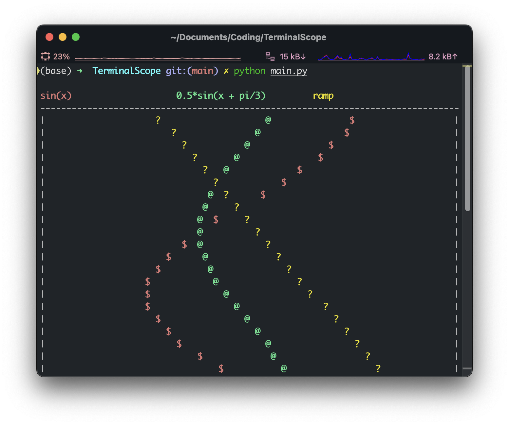

# TerminalScope

A very simple Python oscilloscope for displaying 1-dim dynamic data in the command line.

- Easy to integrate (no third-party libraries required, only a single Python file)
- Typical use cases:
  - Accessing your Raspberry Pi via SSH and wanting to display sensor data in real-time
  - Debugging your motor PID controller and needing a simple graphical user interface

